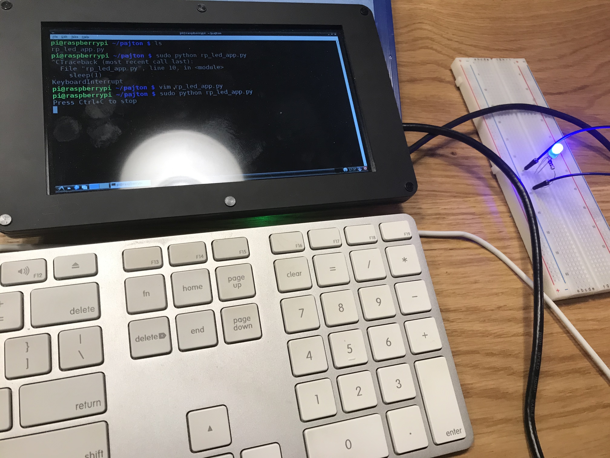

## App which shows how to connect LED to Raspberry Pi and make it blink using Python.

### 1. What do we need for this app:
- Raspberry Pi 3 setup with monitor and USB Mouse & Keyboard
- Checkout this guide if you need help: 
    `https://raspberrypihq.com/making-a-led-blink-using-the-raspberry-pi-and-python/`
- Solderless breadboard
- Jumper wires for easy hookup
- Resistor pack
- Red LED

### 2. Instalation
```sudo apt-get install python-rpi.gpio python3-rpi.gpio```

### 3. Running
```python blinking_led.py```
or as a root
```sudo python blinking_led.py```



### If we decide to stop LED will be disable.
