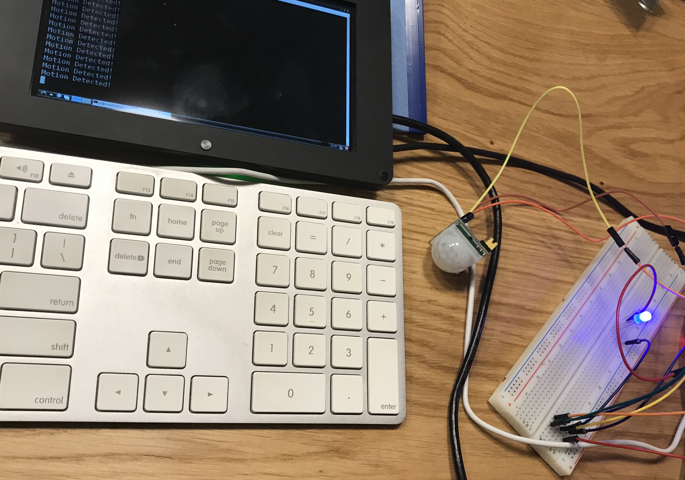

## PIR (Passive Infrared) sensor used  with the Raspberry Pi to turn on an LED  when sensor is activated.

### 1. What do we need for this app:
- Raspberry Pi 3 setup with monitor and USB Mouse & Keyboard
- Checkout this guide if you need help: 
    `https://www.mbtechworks.com/projects/pir-motion-sensor-with-raspberry-pi.html`
- PIR motion sensor
- Solderless breadboard
- Jumper wires for easy hookup
- Resistor pack
- Red LED

### 1. Instalation
```sudo apt-get install python-rpi.gpio python3-rpi.gpio```

### 3. Running
```python pir_sensor.py```
or as a root
```sudo python pir_sensor.py```



### If we decide to stop LED will be disable.